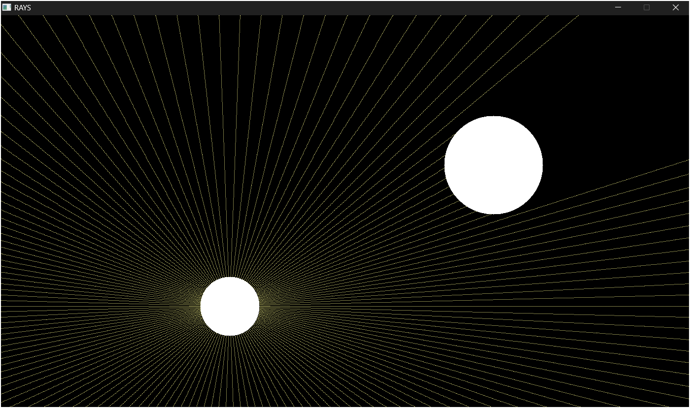

# Ray-Casting in SDL3
## What is this?
My own implementation of a simple ray casting algorithm using C and SDL3. The program simulates a light source that emits rays and when a ray hits an opaque object (circle), it is blocked, creating the effect of shadows. The goal is to visualize how light interacts with opaque objects on a foundational level.

## Componenets
1. Light Source Circle: A circle/source that emits a variable number of rays in all direction from its center. Size, position, and color of the circle can be modifie .
2. Rays: Rays are essentially yellow lines in the program that are cast from the light source.
3. Opaque Circle: An opaque (not transparent) object that blocks any ray hitting it from any direction, leaving a shadow behind.

## Try it yourself!
1. Install **SDL3** on your system:
* **Windows**: Download SDL3 from the official release ([here](https://github.com/libsdl-org/SDL/releases/tag/release-3.2.4)).
Not sure which one? Just download the `SDL3-devel-3.2.4-mingw.zip`.
* **Linux**: Run `sudo apt-get install libsdl3-dev`. If this doesn't work, please figure out how to make it work because I don't speak Linux (yet).
2. Clone the repository:
`git clone https://github.com/xyzeep/Ray-Casting.git`
3. Run the build file:
`build.bat`   
All the source files are inside the directory, so there's no need to tweak anything.

## Note(SOLVED to some extent using WindowSurface instead of a Renderer):
The current implementation becomes kind of choppy when number of rays and/or the ray step is increased, which is acknowledged. Optimization is planned to improve performance.

--- 

Feel free to explore and play with the source code. Inspired by [this guy](https://youtu.be/2BLRLuczykM) on youtbe

